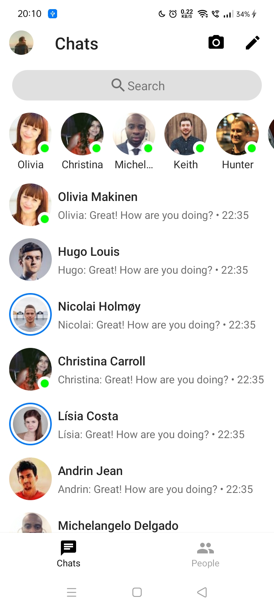
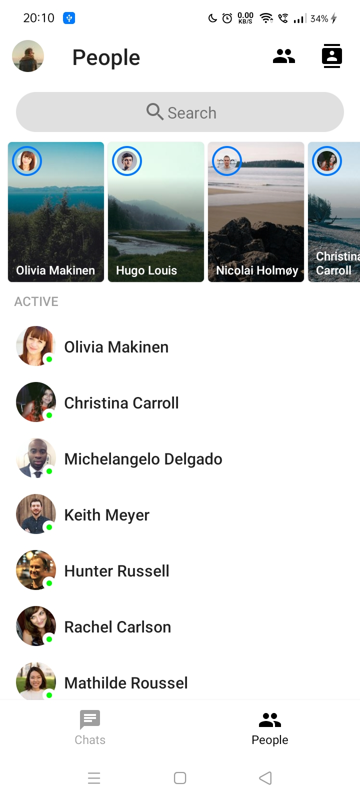
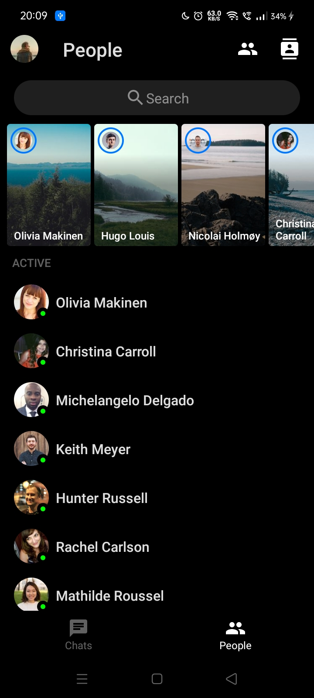
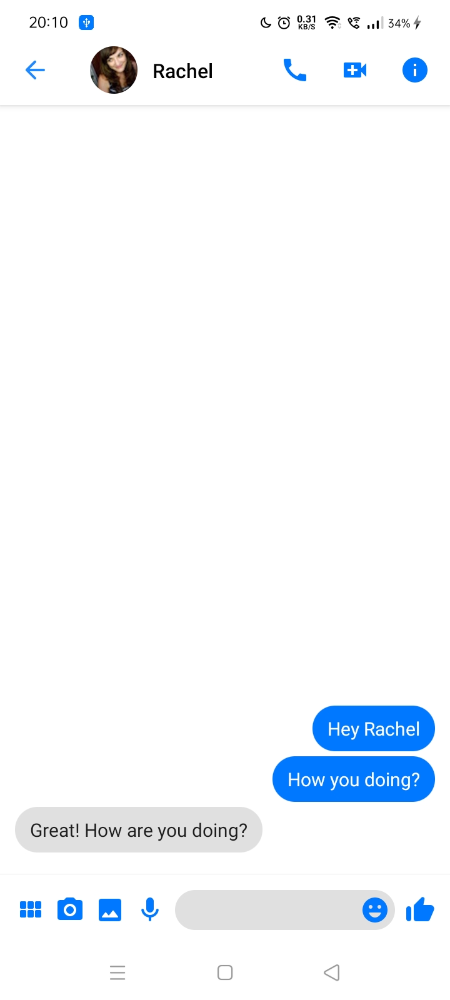
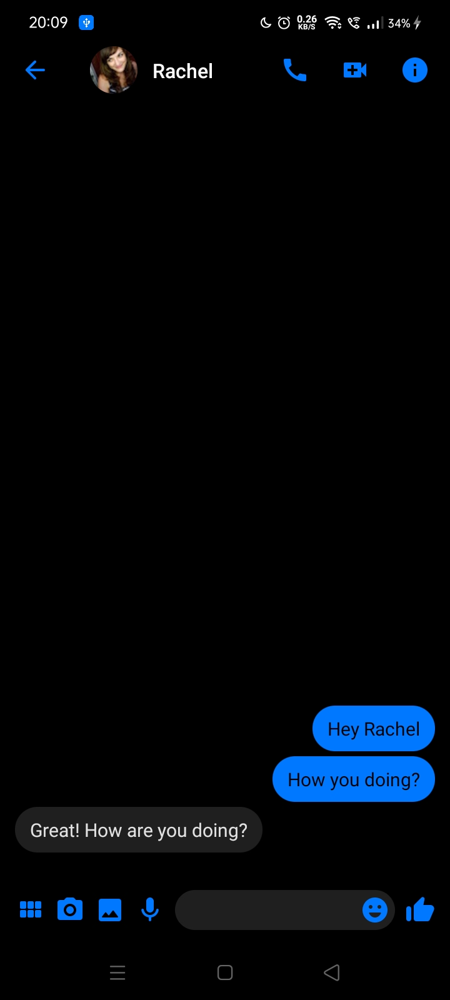

# JetMessenger
Facebook Messenger clone built with Jetpack Compose

## Status: 🚧 In progress 🚧
JetMessenger is still under development and some screens are not yet implemented.

## Screenshots
 
 
 

## Libraries
* [Jetpack Compose](https://developer.android.com/jetpack/compose) (current version: `1.0.0-alpha03`)
* [Accompanist](https://github.com/chrisbanes/accompanist)
* [compose-router](https://github.com/zsoltk/compose-router)
